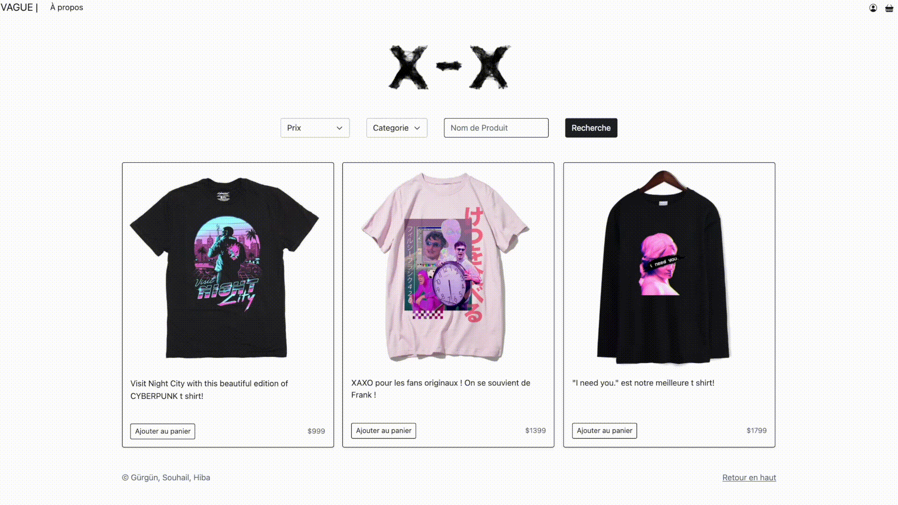
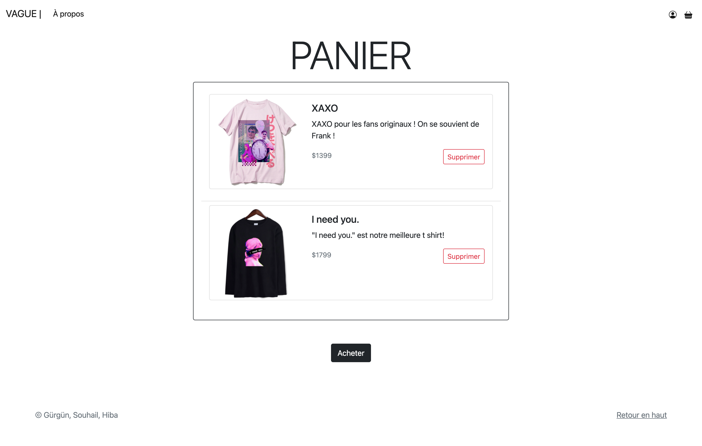
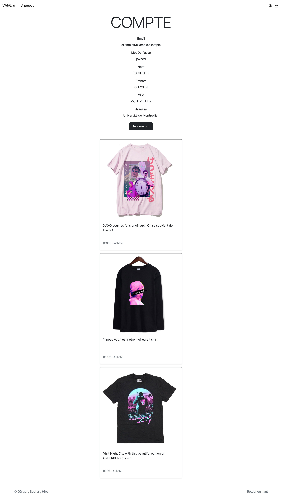

# Vague — E-Commerce Website Written in Vanilla PHP and Bootstrap

## Features

- Modern Bootstrap 5 Design
- Login / Register (account data stored in MySQL)
- Search Filters
- Shopping Cart
- Account Validation Before an Order is Placed
- Order Logic (updates product data)
- Account Page With Info on Previous Orders

## Note

The MIT License was added the same time the code was released publicly. The t-shirt images are not subject to the MIT License and are the property of their respective owners.
